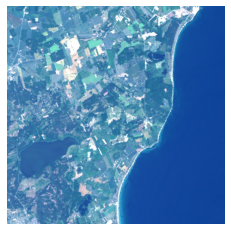
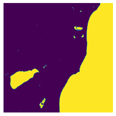
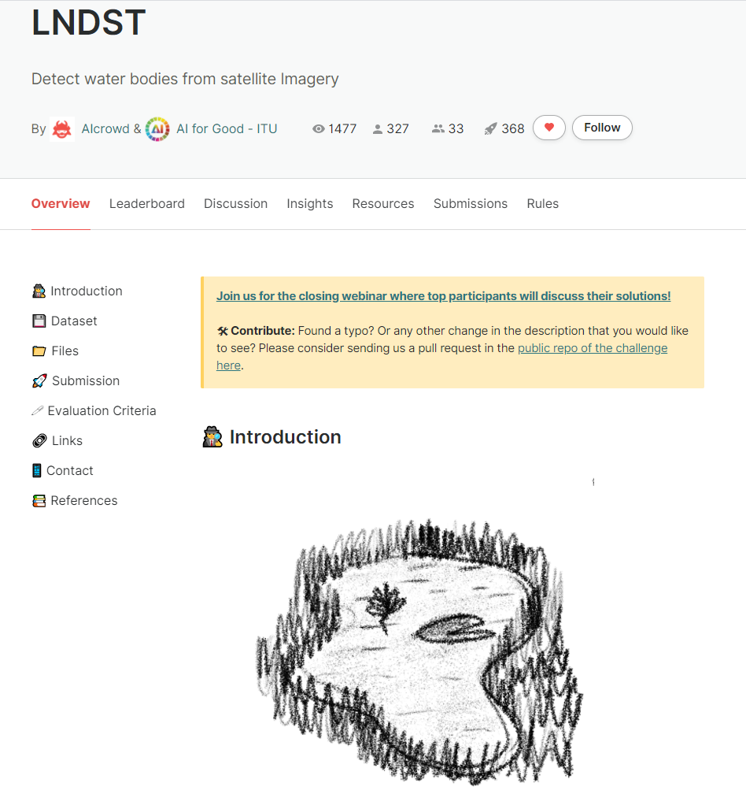

# Water Segmentation 🌊 
This project is based of the AIcrowd competition LNDST to Detect water bodies from satellite Imagery

# Table of Contents

* [About](#about)
* [Built With](#built-with)
* [Getting Started](#getting-started)
  * [Prerequisites](#Prerequisites)
  * [Installation](#Installation)
* [Usage](#Usage)
* [License](#license)
* [Contact](#contact)

# About 
Due to global warming, sources of water are chaing quite dramtically over the years, **A place which was a big lake few year ago, now it's a land!!**. 

So, that's why i made this project to help finding water sources automatically from satellite images using by **Image Segmentation** using **Deep Learning & Computer Vision**.  

So, here are some details about the project -

- The  DL model takes an image and then outputs another image but it contains segmentation between water and simply background/land.

## Model

I used Unet model which is quite good in image segmentation task, i used resnet34 deep for as a transfer learning in Unet, also the model is completely made using **fastaiv2** 

# Built With 
- [FastAI](https://www.fast.ai/) - This is the library to build the DL Model ( Unet ) and training, inference.   
- [Weights & Biases](https://www.wandb.com/) - I did a lot of experimentation, so Weights & Biases helpes me a lot of saving my experiments. 

And bunch of other libraries including os, time, numpy, cv2. 

# Dataset

The dataset is from [AIcrowd LNDST competition](https://www.aicrowd.com/challenges/ai-for-good-ai-blitz-3/problems/lndst) 

 

The dataset contained 1399 training images with corresponding mask and 467 testing images. 

# Weights & Biases Report

The report for this project in Weights & Biases can be found [here](https://app.wandb.ai/shubhamai/water%20segmentation/reports/Water-Segmentation--VmlldzoyNDIzNjk)

# Getting Started

Below are the steps to run the application in your PC or laptop, whatever. 

##  Prerequisites

- Python 3.x - You can download python in [Official Python Site](https://www.python.org/).   

## Installation

### Through Github 

1. Clone the repo using `git clone https://github.com/Shubhamai/mask-detector-app.git`
2. No `requirements.txt` sorry, it's because i run most of the code in google colab, but here are some main library versions that i used - 
 - FastAI - 2.0.0

3. Run `jupyter notebook` and open `Water Segmentation.ipynb`
4. Enjoy 🎊

# License 
Distributed under the GNU General Public License v3.0. See `LICENSE` for more information.

# Contact

Shubhamai - [@Shubhamai](https://twitter.com/Shubhamai) - shubham.aiengineer@gmail.com

Website - [Shubhamai.com](https://Shubhamai.com)
